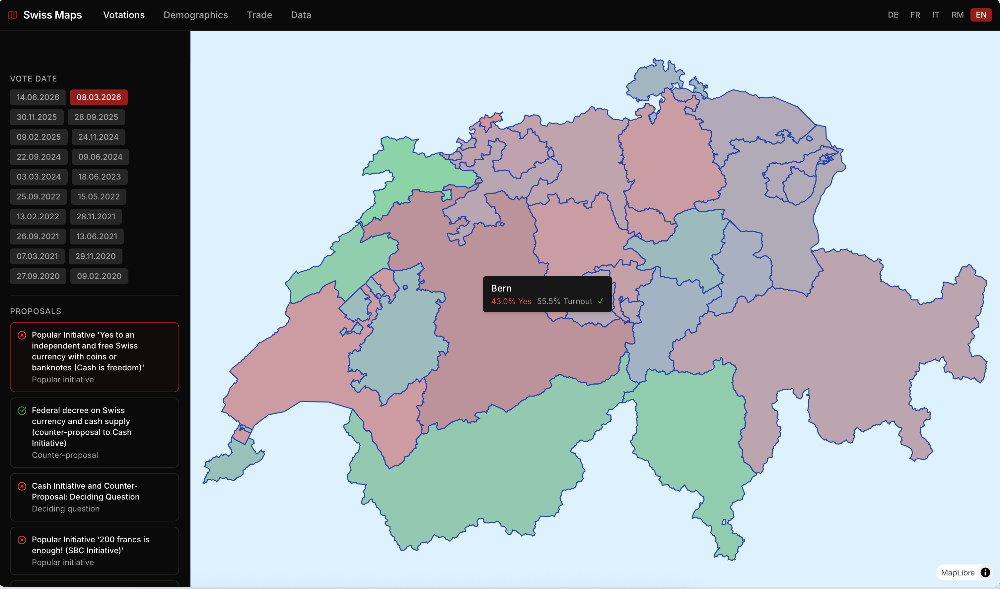
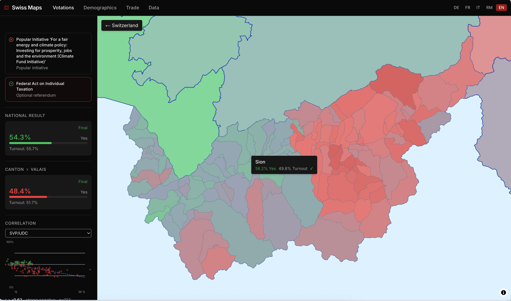
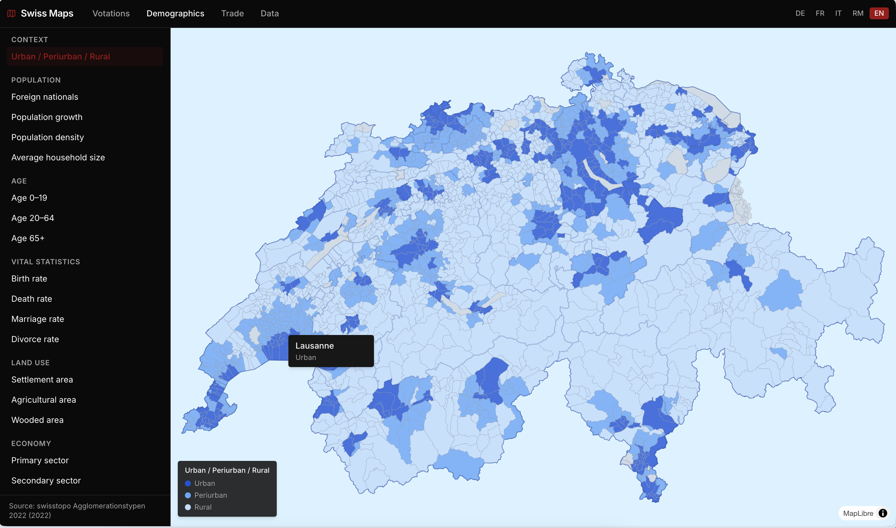
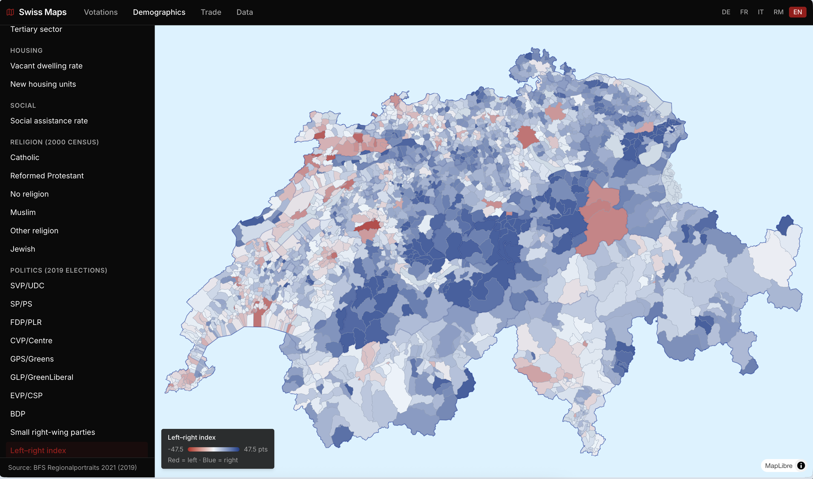
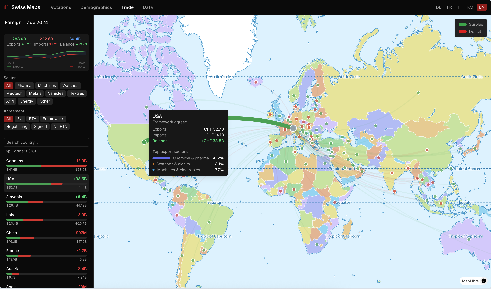
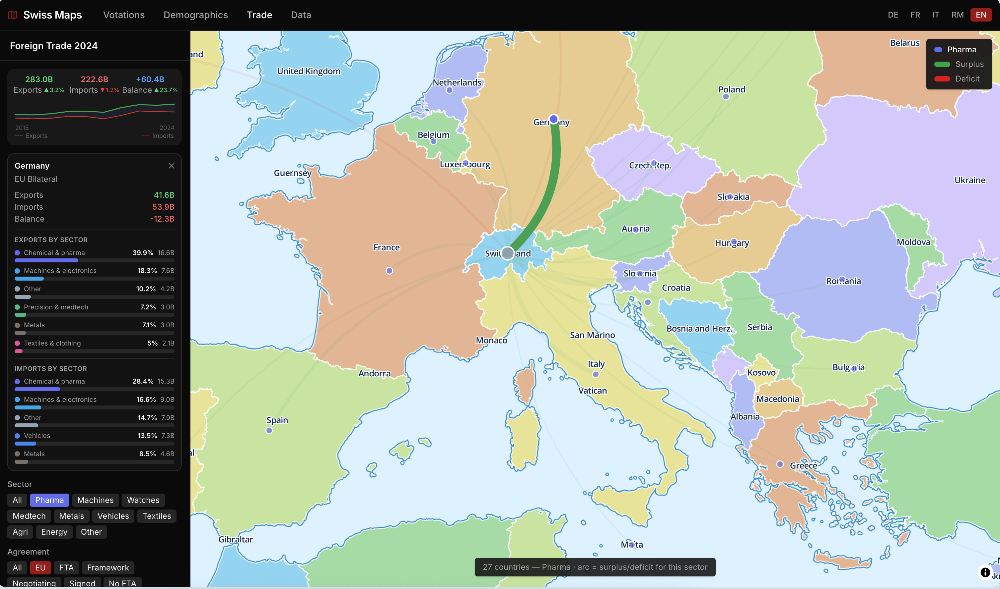

# Swiss Maps

Interactive visualization of Swiss federal votation results and demographic statistics on a geographic map.

## Screenshots

**Votation map — canton overview**


**Votation map — municipality drill-down with correlation scatter**


**Demographics — urban/periurban/rural typology**


**Demographics — left–right political index**


**Trade — world overview with arc lines**


**Trade — Europe zoomed, pharma sector filter**


## Features

**Votation map (`/`)**
- Choropleth map colored by % yes votes at canton, district, and municipality level
- Click a canton to zoom in and see district/municipality breakdown
- Hover tooltips with result details
- 4 past and upcoming votation dates (Sep/Nov 2025, Mar/Jun 2026)
- Defaults to the most recent past votation (skips future dates with no data)

**Demographics map (`/demographics`)**
- 45 indicators across 11 groups: context (urban/periurban/rural typology), population, age, vital statistics (birth/death/marriage/divorce), land use, economy (employment by sector + taxable income), housing, social, religion (2000 census), language (official linguistic region + 2000 census home language), and politics
- Urban/rural typology: categorical 3-class map (dark blue = urban, medium = periurban, light = rural) with swatch legend
- Religion: Catholic %, Reformed %, Muslim %, no religion %, other — from 2000 census (last available at municipality level)
- Language: official linguistic region (German/French/Italian/Romansh, categorical) plus home-language shares from the 2000 census
- Income: median and average taxable income per commune (CHF, 2022)
- Party votes shown individually plus a computed left–right index (diverging red↔blue scale)
- Sequential blue scale for continuous indicators; P5–P95 domain per topic

**Trade map (`/trade`)**
- World choropleth map with curved arc lines connecting Switzerland to each trading partner
- Arc width = trade volume (total or sector); arc color = green (CH surplus) / red (CH deficit) — always based on the active sector's balance, not a flat color
- Sector filter (9 sectors): recalculates arc sizing + balance + sorting for the selected sector only
- Per-country sector breakdown from SwissImpex 2025 HS8 data — shown in hover tooltip and selected-country card with % share + estimated CHF value per sector
- Click a country dot or sidebar row to select and pin the detail card; click Switzerland to show all flows
- FTA status filter (EU bilateral / in force / framework / negotiating / signed / all)
- 96 trading partners from official 2024 BAZG data (business cycle total, excl. precious metals)
- Sidebar shows global sector export breakdown (pharma 49%, machines 12%, watches 10%, …)

**Correlation scatter (in votation sidebar)**
- Inline SVG scatter: X = any demographic indicator, Y = % yes votes
- Shows canton-level dots (26 points) by default; switches to municipality-level dots when a canton is selected
- Linear regression line + Pearson r with plain-language interpretation
- Topic picker groups match the demographics page

**Shared**
- Full i18n: DE / FR / IT / RM / EN (UI + votation titles from official data)
- Mobile-responsive with collapsible sidebar
- English as default language

## Running locally

```bash
pnpm install
pnpm dev        # requires geo + data files — see pipeline below
```

## Data pipeline

All data is preprocessed by a Python pipeline (requires `uv`) and served as static files.

```bash
cd pipeline
uv sync

# One-time: Swiss boundaries from swisstopo (~50MB)
uv run python scripts/download_boundaries.py
uv run python scripts/export_geo.py

# Votation results
uv run python scripts/download_votations.py
uv run python scripts/download_votations.py --add YYYYMMDD   # add a new date

# Trade data (BAZG official 2024 actuals — re-run to refresh)
uv run python scripts/download_trade.py

# Demographic indicators — run in order:
uv run python scripts/download_income.py         # ESTV taxable income 2022 (median + average)
uv run python scripts/download_language.py       # BFS linguistic region + 2000 census home language
uv run python scripts/download_demographics.py   # BFS Regionalportraits 2021 + merges income/language/typology/religion
uv run python scripts/download_typology.py       # swisstopo urban/periurban/rural classification
uv run python scripts/download_religion.py       # BFS 2000 census religion data (2000 data only)
```

See `pipeline/DATA_SOURCES.md` for a full breakdown of every dataset, indicator, reference year, and known limitations (unemployment and post-2000 religion/language are not available via API).

## Testing

```bash
pnpm test          # unit + component tests (Vitest + React Testing Library)
pnpm test:watch    # same, in watch mode

pnpm exec playwright install chromium   # one-time browser install
pnpm dev                                 # in one terminal — needs geo + votation data, see pipeline above
pnpm test:e2e                            # in another terminal (Playwright)
```

Unit/component tests are co-located with the source as `*.test.ts(x)` (e.g. `lib/votation.test.ts`,
`components/result-block.test.tsx`). E2E specs live in `e2e/*.spec.ts` and run against the local dev
server. CI runs lint, typecheck, and `pnpm test` on every push/PR; `pnpm test:e2e` is local-only for
now since it depends on the gitignored `public/geo` and `public/votations` pipeline output.

## Data sources

- **Trade (bilateral totals)**: [BAZG Annual Report 2024](https://www.bazg.admin.ch) — 2024 actuals, business cycle total (excl. precious metals), 245 countries
- **Trade (sector breakdown)**: [SwissImpex / BAZG TN8_VK](https://www.swissimpex.admin.ch) — 2025 full year, HS8 tariff × country × transport mode; used for per-country sector shares
- **Geography**: [swisstopo swissBOUNDARIES3D](https://www.swisstopo.admin.ch/en/landscape-model-swissboundaries3d) — OGD license
- **Votation results**: [opendata.swiss](https://opendata.swiss) federal votation JSON API
- **Demographic indicators**: [BFS Regionalportraits 2021](https://opendata.swiss/en/dataset/regionalportrats-2021-kennzahlen-aller-gemeinden) — 30 indicators, ref. year 2019
- **Religion**: BFS Volkszählung 2000 (PxWeb `px-x-4003000000_122`) — **2000 data only**, no municipality-level religion data exists post-2000
- **Urban/rural typology**: swisstopo `g1a22` agglomeration shapefile — 3 classes (urban/periurban/rural)
- **Taxable income**: [ESTV Steuerstatistik der direkten Bundessteuer](https://www.estv.admin.ch) — nationwide municipality xlsx, tax year 2022, median + average per commune
- **Linguistic region**: BFS Raumgliederungen der Gemeinden (`agvchapp` API, `SPRGEB2020`) — current official German/French/Italian/Romansh language area per commune
- **Home language**: BFS Volkszählung 2000 (PxWeb `px-x-4003000000_123`) — **2000 data only**, same limitation as religion

## Tech stack

Next.js 16 · React 19 · MapLibre GL JS · shadcn/ui · Tailwind CSS 4 · TypeScript · Python/GeoPandas

## notes

for easier deployment, all data is currently pushed to the repo